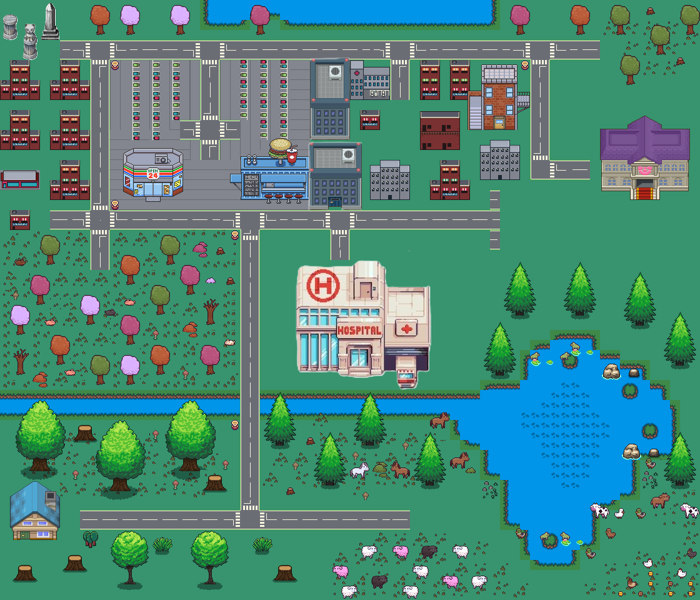

# 🕹️ 2D Educational Game

Welcome to the 2D Educational Game, an interactive and engaging experience for kids to explore, solve quizzes, and learn in a fun environment. Built with Kaboom.js, this game allows players to navigate through rooms and interact with different animals while answering questions.

## 🌍 Live Demo

🔗 Play the game here: [https://shimmering-speculoos-1239f5.netlify.app/](#)

## 📜 Features

- 🎮 Smooth player movement with animations (walk, idle, direction-based)
- 🎭 Interactive dialogues and quizzes
- 🏞️ Custom sprite-based map
- 🖱️ Mouse and keyboard support
- 🔊 Dynamic feedback on quiz responses

## 🚀 How to Play

1. Move the character using the arrow keys or mouse clicks.
2. Interact with objects or NPCs to trigger dialogues and quizzes.
3. Answer questions correctly to unlock hints and progress.
4. Explore different rooms and complete challenges!

## 🛠️ Built With

- **Kaboom.js** - A fun JavaScript game engine
- **HTML, CSS, JavaScript**
- **Netlify** (for deployment)

## 📥 Installation & Running Locally

Clone this repository and install dependencies:

```sh
  git clone https://github.com/YOUR_USERNAME/kaboom-game.git
  cd kaboom-game
  npm install  # (if dependencies exist)
  npm run start # or use a simple live server extension
```


## 📷 Map structure



## 🎨 Credits

- Sprites and assets created manually
- Powered by Kaboom.js

## 📜 License

This project is open-source under the MIT License. Feel free to contribute!

Enjoy playing and learning! 🎉
